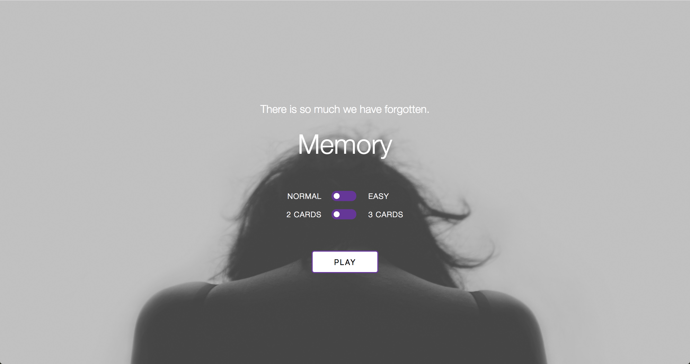

# Memory Game

[Game rules](https://en.wikipedia.org/wiki/Concentration_(game))

## Setup

**Start the development server**
`npm run dev`

Once it’s running, you can view the app at `localhost:3000`.

**Run tests**
`npm test`
